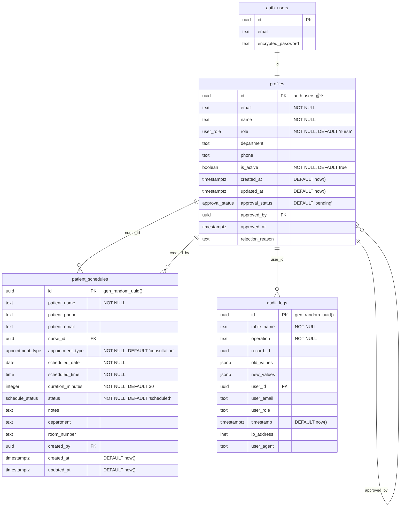
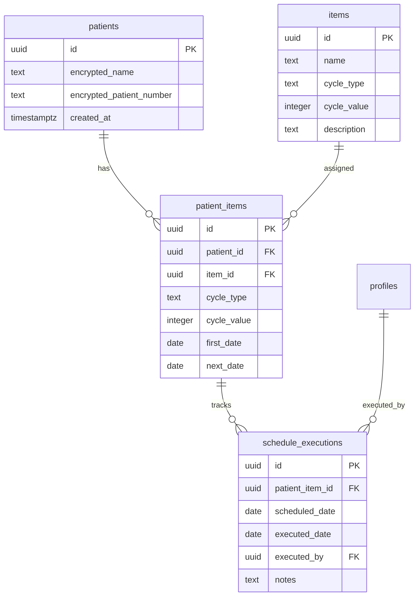

# 현재 데이터베이스 ERD (Entity Relationship Diagram)

## Mermaid ERD

## 테이블 관계 설명

### 1. profiles ↔ auth.users
- **관계**: 1:1 (One-to-One)
- **설명**: 각 사용자 인증 정보는 하나의 프로필을 가짐
- **FK**: profiles.id → auth.users.id

### 2. profiles ↔ patient_schedules (nurse_id)
- **관계**: 1:N (One-to-Many)
- **설명**: 한 간호사가 여러 환자 일정을 담당
- **FK**: patient_schedules.nurse_id → profiles.id

### 3. profiles ↔ patient_schedules (created_by)
- **관계**: 1:N (One-to-Many)
- **설명**: 한 사용자가 여러 일정을 생성
- **FK**: patient_schedules.created_by → profiles.id

### 4. profiles ↔ profiles (approved_by)
- **관계**: 1:N (Self-referencing)
- **설명**: 관리자가 다른 사용자를 승인
- **FK**: profiles.approved_by → profiles.id

### 5. profiles ↔ audit_logs
- **관계**: 1:N (One-to-Many)
- **설명**: 한 사용자가 여러 감사 로그를 생성
- **FK**: audit_logs.user_id → auth.users.id

## ENUM 타입 정의

### user_role
- `nurse`: 간호사
- `admin`: 관리자

### approval_status
- `pending`: 대기중
- `approved`: 승인됨
- `rejected`: 거부됨

### appointment_type
- `consultation`: 상담
- `treatment`: 치료
- `follow_up`: 추적관찰
- `emergency`: 응급
- `routine_check`: 정기검진

### schedule_status
- `scheduled`: 예정됨
- `in_progress`: 진행중
- `completed`: 완료
- `cancelled`: 취소
- `no_show`: 미출현

## 뷰 (Views)

### database_health
- 데이터베이스 상태 모니터링 메트릭
- 실시간 성능 지표 제공

### performance_metrics
- 테이블별 크기 및 레코드 수
- 스토리지 사용량 모니터링

## 주요 인덱스

### profiles 테이블
- PK: id
- 인덱스: email, role, department, is_active, approval_status
- 복합 인덱스: (role, department, is_active)

### patient_schedules 테이블
- PK: id
- 인덱스: nurse_id, created_by, scheduled_date, status, department
- 복합 인덱스: 
  - (scheduled_date, scheduled_time)
  - (department, scheduled_date)
  - (nurse_id, scheduled_date, status)

### audit_logs 테이블
- PK: id
- 인덱스: table_name, operation, user_id, timestamp

## 트리거

### profiles 테이블
- `update_profiles_updated_at`: UPDATE 시 updated_at 갱신
- `audit_profiles_trigger`: 모든 변경사항 감사 로그 기록

### patient_schedules 테이블
- `update_patient_schedules_updated_at`: UPDATE 시 updated_at 갱신
- `audit_schedules_trigger`: 모든 변경사항 감사 로그 기록

## RLS (Row Level Security) 정책

### profiles
- 본인 프로필 조회/수정
- 관리자 전체 권한
- 승인 상태에 따른 접근 제어

### patient_schedules
- 담당 일정 조회/수정
- 부서별 일정 조회
- 관리자 전체 권한

### audit_logs
- 관리자만 조회 가능

## 현재 스키마의 한계점

1. **반복 일정 미지원**: 단발성 예약만 가능
2. **환자 관리 부재**: 별도 환자 테이블 없음
3. **검사/주사 항목 없음**: 항목 정의 테이블 부재
4. **암호화 미적용**: 환자 개인정보 평문 저장
5. **자동 계산 없음**: 다음 예정일 자동 계산 로직 부재

## PRD 요구사항 충족을 위한 필요 테이블

---

*생성일: 2025-08-18*
*프로젝트: 케어스케줄러*