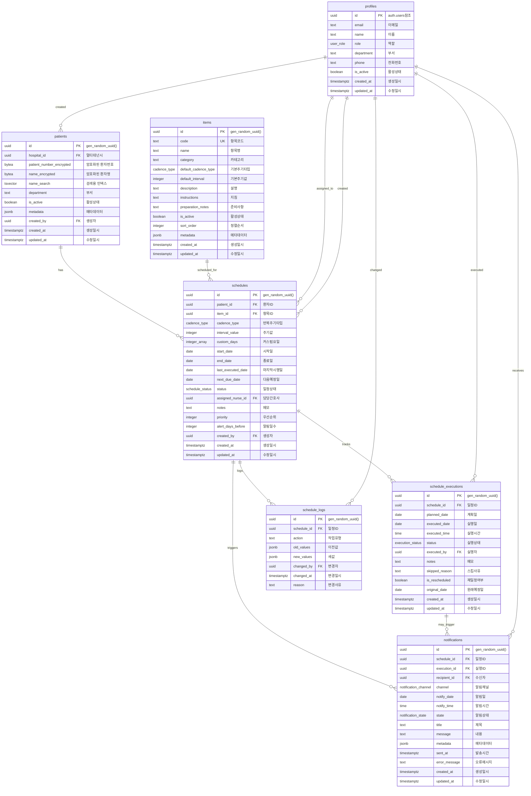
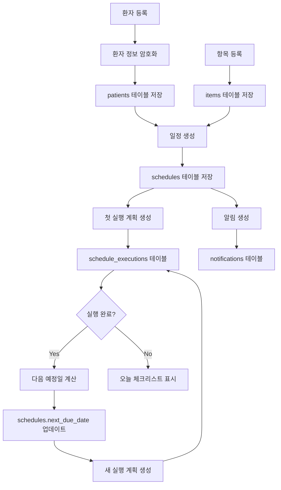
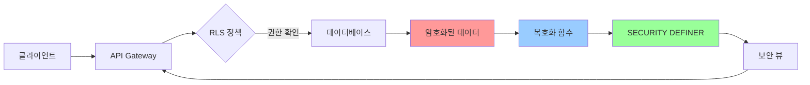
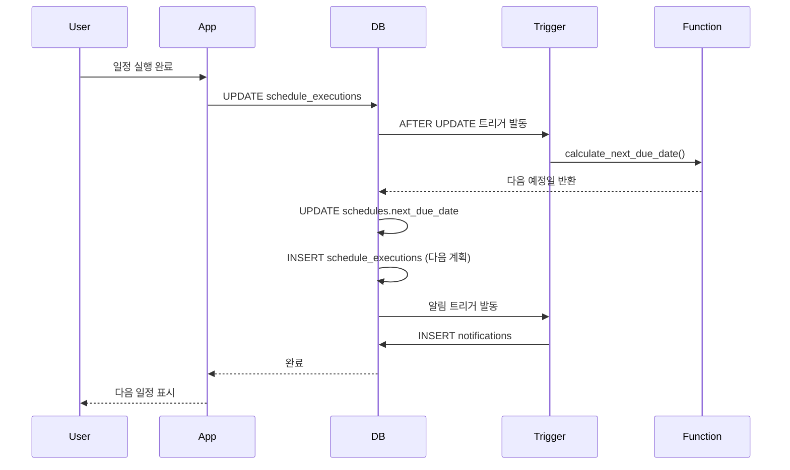

# 목표 데이터베이스 ERD (Entity Relationship Diagram)

## 전체 스키마 ERD

## 핵심 관계 설명

### 1. 환자-일정 관계 (patients ↔ schedules)
- **관계**: 1:N (One-to-Many)
- **설명**: 한 환자는 여러 반복 일정을 가질 수 있음
- **특징**: 각 일정은 하나의 검사/주사 항목과 연결됨

### 2. 항목-일정 관계 (items ↔ schedules)
- **관계**: 1:N (One-to-Many)
- **설명**: 하나의 검사/주사 항목이 여러 환자 일정에 사용됨
- **특징**: 항목별 기본 주기 설정 제공

### 3. 일정-실행 관계 (schedules ↔ schedule_executions)
- **관계**: 1:N (One-to-Many)
- **설명**: 하나의 반복 일정에 대해 여러 실행 기록 존재
- **특징**: 계획일과 실제 실행일 분리 관리

### 4. 일정-알림 관계 (schedules ↔ notifications)
- **관계**: 1:N (One-to-Many)
- **설명**: 하나의 일정에 대해 여러 알림 생성 가능
- **특징**: 예정일 N일 전 자동 알림 생성

### 5. 프로필-일정 관계 (profiles ↔ schedules)
- **관계**: 1:N (One-to-Many)
- **설명**: 간호사가 여러 일정을 담당/생성
- **특징**: 담당자와 생성자 구분

## 데이터 플로우

## 보안 아키텍처

## 자동화 프로세스

## 인덱스 전략

### 주요 조회 패턴
1. **오늘 체크리스트**: `schedule_executions.planned_date = CURRENT_DATE`
2. **환자별 일정**: `schedules.patient_id = ?`
3. **다가오는 일정**: `schedules.next_due_date BETWEEN ? AND ?`
4. **담당 간호사 일정**: `schedules.assigned_nurse_id = ?`

### 복합 인덱스
- `(patient_id, next_due_date, status)`: 환자별 활성 일정 조회
- `(planned_date, status)`: 날짜별 실행 계획 조회

## 확장 포인트

### 1. 멀티테넌시
- `hospital_id` 필드 활용
- RLS 정책에 병원 ID 조건 추가
- 병원별 데이터 완전 격리

### 2. CSV 임포트
- `import_patients_csv()` 함수 구현
- 대량 데이터 처리 최적화
- 오류 처리 및 롤백

### 3. 알림 시스템
- Push 알림 연동
- 이메일 발송 연동
- 알림 템플릿 관리

### 4. 감사 로그
- 모든 변경사항 추적
- 규정 준수 보고서
- 접근 기록 관리

---

*생성일: 2025-08-18*
*프로젝트: 케어스케줄러*