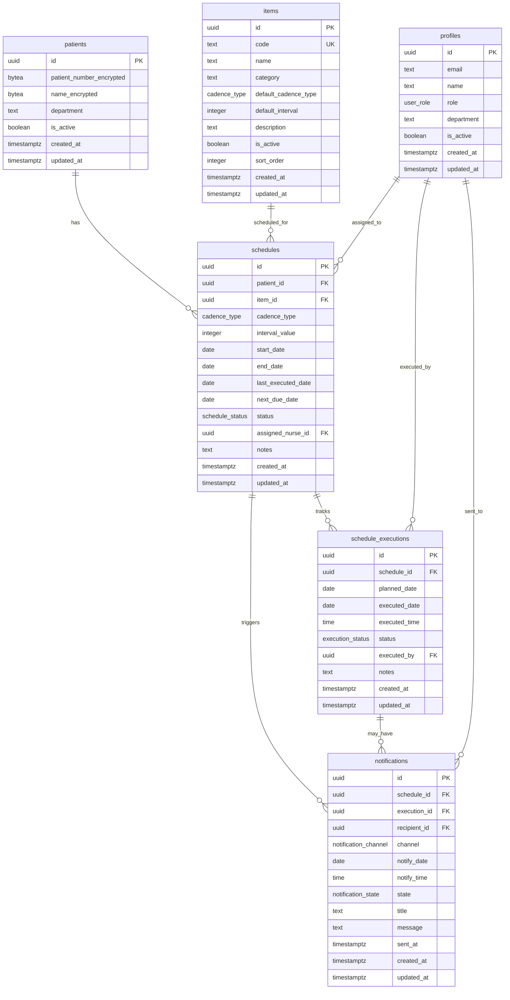

# 목표 데이터베이스 스키마 설계서

## 문서 정보
- **작성일**: 2025-08-18
- **프로젝트**: 케어스케줄러 (Care Scheduler)
- **버전**: 1.0.0
- **목적**: PRD/IA 요구사항 충족을 위한 최적 스키마 설계

## 1. 설계 원칙

### 1.1 핵심 설계 목표
1. **반복 일정 자동화**: 주기적 검사/주사 일정의 자동 계산 및 관리
2. **데이터 보안**: 환자 개인정보 암호화 저장 (pgcrypto)
3. **성능 최적화**: 오늘 체크리스트 조회 < 50ms
4. **확장성**: 멀티테넌시, CSV 임포트, 알림 시스템 확장 가능
5. **데이터 무결성**: 강력한 제약조건과 트리거 기반 자동화

### 1.2 기술 스택
- PostgreSQL 14+ (Supabase)
- pgcrypto extension (암호화)
- pg_trgm extension (텍스트 검색)
- Row Level Security (RLS)

## 2. 타입 정의

### 2.1 ENUM 타입
```sql
-- 반복 주기 타입
CREATE TYPE cadence_type AS ENUM ('daily', 'weekly', 'monthly', 'custom');

-- 일정 상태
CREATE TYPE schedule_status AS ENUM ('active', 'paused', 'completed', 'cancelled');

-- 실행 상태
CREATE TYPE execution_status AS ENUM ('planned', 'completed', 'skipped', 'overdue');

-- 알림 채널
CREATE TYPE notification_channel AS ENUM ('dashboard', 'push', 'email');

-- 알림 상태
CREATE TYPE notification_state AS ENUM ('pending', 'ready', 'sent', 'failed');

-- 사용자 역할 (기존 활용)
-- user_role: nurse, admin
```

## 3. 핵심 테이블 설계

### 3.1 patients (환자 정보)
| 컬럼명 | 타입 | 제약조건 | 설명 |
|--------|------|---------|------|
| id | uuid | PK, DEFAULT gen_random_uuid() | 환자 ID |
| hospital_id | uuid | FK, NULL (향후 멀티테넌시) | 병원 ID |
| patient_number_encrypted | bytea | NOT NULL | 암호화된 환자번호 |
| name_encrypted | bytea | NOT NULL | 암호화된 환자명 |
| name_search | tsvector | GENERATED | 검색용 토큰 |
| department | text | NULL | 담당 부서 |
| is_active | boolean | DEFAULT true | 활성 상태 |
| metadata | jsonb | DEFAULT '{}' | 추가 메타데이터 |
| created_by | uuid | FK profiles(id) | 생성자 |
| created_at | timestamptz | DEFAULT now() | 생성일시 |
| updated_at | timestamptz | DEFAULT now() | 수정일시 |

### 3.2 items (검사/주사 항목)
| 컬럼명 | 타입 | 제약조건 | 설명 |
|--------|------|---------|------|
| id | uuid | PK, DEFAULT gen_random_uuid() | 항목 ID |
| code | text | UNIQUE, NOT NULL | 항목 코드 |
| name | text | NOT NULL | 항목명 |
| category | text | NOT NULL | 카테고리 (검사/주사/처치) |
| default_cadence_type | cadence_type | DEFAULT 'monthly' | 기본 주기 타입 |
| default_interval | integer | DEFAULT 1, CHECK > 0 | 기본 주기 값 |
| description | text | NULL | 상세 설명 |
| instructions | text | NULL | 시행 지침 |
| preparation_notes | text | NULL | 준비사항 |
| is_active | boolean | DEFAULT true | 활성 상태 |
| sort_order | integer | DEFAULT 0 | 정렬 순서 |
| metadata | jsonb | DEFAULT '{}' | 추가 메타데이터 |
| created_at | timestamptz | DEFAULT now() | 생성일시 |
| updated_at | timestamptz | DEFAULT now() | 수정일시 |

### 3.3 schedules (반복 일정 정의)
| 컬럼명 | 타입 | 제약조건 | 설명 |
|--------|------|---------|------|
| id | uuid | PK, DEFAULT gen_random_uuid() | 일정 ID |
| patient_id | uuid | FK patients(id), NOT NULL | 환자 ID |
| item_id | uuid | FK items(id), NOT NULL | 항목 ID |
| cadence_type | cadence_type | NOT NULL | 반복 주기 타입 |
| interval_value | integer | NOT NULL, CHECK > 0 | 주기 값 |
| custom_days | integer[] | NULL | 커스텀 요일 (0=일, 6=토) |
| start_date | date | NOT NULL | 시작일 |
| end_date | date | NULL | 종료일 |
| last_executed_date | date | NULL | 마지막 시행일 |
| next_due_date | date | NOT NULL | 다음 예정일 |
| status | schedule_status | DEFAULT 'active' | 일정 상태 |
| assigned_nurse_id | uuid | FK profiles(id) | 담당 간호사 |
| notes | text | NULL | 메모 |
| priority | integer | DEFAULT 0 | 우선순위 |
| alert_days_before | integer | DEFAULT 7 | 알림 일수 |
| created_by | uuid | FK profiles(id) | 생성자 |
| created_at | timestamptz | DEFAULT now() | 생성일시 |
| updated_at | timestamptz | DEFAULT now() | 수정일시 |

**제약조건**:
- UNIQUE(patient_id, item_id, status) WHERE status = 'active'
- CHECK(end_date IS NULL OR end_date >= start_date)
- CHECK(next_due_date >= start_date)

### 3.4 schedule_executions (일정 실행 기록)
| 컬럼명 | 타입 | 제약조건 | 설명 |
|--------|------|---------|------|
| id | uuid | PK, DEFAULT gen_random_uuid() | 실행 ID |
| schedule_id | uuid | FK schedules(id), NOT NULL | 일정 ID |
| planned_date | date | NOT NULL | 계획일 |
| executed_date | date | NULL | 실제 시행일 |
| executed_time | time | NULL | 실제 시행 시간 |
| status | execution_status | DEFAULT 'planned' | 실행 상태 |
| executed_by | uuid | FK profiles(id) | 시행자 |
| notes | text | NULL | 시행 메모 |
| skipped_reason | text | NULL | 스킵 사유 |
| is_rescheduled | boolean | DEFAULT false | 재일정 여부 |
| original_date | date | NULL | 원래 예정일 |
| created_at | timestamptz | DEFAULT now() | 생성일시 |
| updated_at | timestamptz | DEFAULT now() | 수정일시 |

**제약조건**:
- UNIQUE(schedule_id, planned_date)
- CHECK(executed_date IS NOT NULL WHEN status = 'completed')

### 3.5 notifications (알림)
| 컬럼명 | 타입 | 제약조건 | 설명 |
|--------|------|---------|------|
| id | uuid | PK, DEFAULT gen_random_uuid() | 알림 ID |
| schedule_id | uuid | FK schedules(id) | 일정 ID |
| execution_id | uuid | FK schedule_executions(id) | 실행 ID |
| recipient_id | uuid | FK profiles(id), NOT NULL | 수신자 |
| channel | notification_channel | NOT NULL | 알림 채널 |
| notify_date | date | NOT NULL | 알림 예정일 |
| notify_time | time | DEFAULT '09:00' | 알림 시간 |
| state | notification_state | DEFAULT 'pending' | 알림 상태 |
| title | text | NOT NULL | 알림 제목 |
| message | text | NOT NULL | 알림 내용 |
| metadata | jsonb | DEFAULT '{}' | 추가 데이터 |
| sent_at | timestamptz | NULL | 발송 시간 |
| error_message | text | NULL | 오류 메시지 |
| created_at | timestamptz | DEFAULT now() | 생성일시 |
| updated_at | timestamptz | DEFAULT now() | 수정일시 |

### 3.6 schedule_logs (일정 변경 이력)
| 컬럼명 | 타입 | 제약조건 | 설명 |
|--------|------|---------|------|
| id | uuid | PK, DEFAULT gen_random_uuid() | 로그 ID |
| schedule_id | uuid | FK schedules(id), NOT NULL | 일정 ID |
| action | text | NOT NULL | 작업 유형 |
| old_values | jsonb | NULL | 이전 값 |
| new_values | jsonb | NULL | 새 값 |
| changed_by | uuid | FK profiles(id) | 변경자 |
| changed_at | timestamptz | DEFAULT now() | 변경일시 |
| reason | text | NULL | 변경 사유 |

## 4. 보안 뷰 및 함수

### 4.1 암호화 관련 함수
```sql
-- 암호화 키 가져오기 (환경변수)
CREATE OR REPLACE FUNCTION get_encryption_key()
RETURNS text
LANGUAGE plpgsql
SECURITY DEFINER
AS $$
BEGIN
  RETURN current_setting('app.encryption_key');
END;
$$;

-- 환자 정보 암호화
CREATE OR REPLACE FUNCTION encrypt_patient_data(plain_text text)
RETURNS bytea
LANGUAGE plpgsql
SECURITY DEFINER
AS $$
BEGIN
  RETURN pgp_sym_encrypt(plain_text, get_encryption_key());
END;
$$;

-- 환자 정보 복호화
CREATE OR REPLACE FUNCTION decrypt_patient_data(encrypted_data bytea)
RETURNS text
LANGUAGE plpgsql
SECURITY DEFINER
AS $$
BEGIN
  RETURN pgp_sym_decrypt(encrypted_data, get_encryption_key());
END;
$$;
```

### 4.2 보안 뷰
```sql
-- 환자 정보 보안 뷰
CREATE VIEW patients_secure AS
SELECT 
  id,
  hospital_id,
  decrypt_patient_data(patient_number_encrypted) AS patient_number,
  decrypt_patient_data(name_encrypted) AS name,
  department,
  is_active,
  metadata,
  created_by,
  created_at,
  updated_at
FROM patients
WHERE auth.uid() IN (
  SELECT id FROM profiles 
  WHERE role IN ('nurse', 'admin') 
  AND is_active = true
);

-- 오늘의 체크리스트 뷰
CREATE VIEW today_checklist AS
SELECT 
  se.id AS execution_id,
  s.id AS schedule_id,
  p.id AS patient_id,
  decrypt_patient_data(p.name_encrypted) AS patient_name,
  decrypt_patient_data(p.patient_number_encrypted) AS patient_number,
  p.department,
  i.name AS item_name,
  i.category AS item_category,
  i.instructions,
  se.planned_date,
  se.executed_date,
  se.executed_time,
  se.status AS execution_status,
  s.assigned_nurse_id,
  s.notes AS schedule_notes,
  se.notes AS execution_notes,
  s.priority
FROM schedule_executions se
JOIN schedules s ON se.schedule_id = s.id
JOIN patients p ON s.patient_id = p.id
JOIN items i ON s.item_id = i.id
WHERE se.planned_date = CURRENT_DATE
  AND s.status = 'active'
  AND se.status IN ('planned', 'overdue')
ORDER BY s.priority DESC, p.department, i.sort_order;
```

## 5. 자동화 함수 및 트리거

### 5.1 다음 예정일 계산 함수
```sql
CREATE OR REPLACE FUNCTION calculate_next_due_date(
  p_cadence_type cadence_type,
  p_interval_value integer,
  p_reference_date date,
  p_custom_days integer[] DEFAULT NULL
)
RETURNS date
LANGUAGE plpgsql
AS $$
DECLARE
  v_next_date date;
BEGIN
  CASE p_cadence_type
    WHEN 'daily' THEN
      v_next_date := p_reference_date + (p_interval_value || ' days')::interval;
    
    WHEN 'weekly' THEN
      v_next_date := p_reference_date + (p_interval_value || ' weeks')::interval;
    
    WHEN 'monthly' THEN
      -- 월말 처리 로직 포함
      v_next_date := p_reference_date + (p_interval_value || ' months')::interval;
      -- 월말 보정: 원래 날짜가 월말이었으면 다음 달 월말로
      IF date_trunc('month', p_reference_date) + interval '1 month' - interval '1 day' = p_reference_date THEN
        v_next_date := date_trunc('month', v_next_date) + interval '1 month' - interval '1 day';
      END IF;
    
    WHEN 'custom' THEN
      -- 특정 요일 기반 계산
      -- 구현 예정
      v_next_date := p_reference_date + interval '1 day';
    
    ELSE
      v_next_date := p_reference_date + interval '1 day';
  END CASE;
  
  RETURN v_next_date;
END;
$$;

-- 일정 실행 후 다음 예정일 업데이트 트리거
CREATE OR REPLACE FUNCTION update_next_due_date()
RETURNS trigger
LANGUAGE plpgsql
AS $$
BEGIN
  IF NEW.status = 'completed' AND NEW.executed_date IS NOT NULL THEN
    UPDATE schedules
    SET 
      last_executed_date = NEW.executed_date,
      next_due_date = calculate_next_due_date(
        cadence_type, 
        interval_value, 
        NEW.executed_date,
        custom_days
      ),
      updated_at = now()
    WHERE id = NEW.schedule_id;
    
    -- 다음 실행 계획 자동 생성
    INSERT INTO schedule_executions (
      schedule_id, 
      planned_date, 
      status
    )
    SELECT 
      NEW.schedule_id,
      next_due_date,
      'planned'
    FROM schedules
    WHERE id = NEW.schedule_id
    ON CONFLICT (schedule_id, planned_date) DO NOTHING;
  END IF;
  
  RETURN NEW;
END;
$$;

CREATE TRIGGER trigger_update_next_due_date
AFTER UPDATE OF status, executed_date ON schedule_executions
FOR EACH ROW
EXECUTE FUNCTION update_next_due_date();
```

### 5.2 알림 생성 트리거
```sql
CREATE OR REPLACE FUNCTION create_schedule_notifications()
RETURNS trigger
LANGUAGE plpgsql
AS $$
BEGIN
  -- 일정 생성/수정 시 알림 자동 생성
  IF NEW.status = 'active' THEN
    -- 기존 알림 삭제
    DELETE FROM notifications 
    WHERE schedule_id = NEW.id 
    AND state = 'pending';
    
    -- 새 알림 생성 (예정일 7일 전)
    INSERT INTO notifications (
      schedule_id,
      recipient_id,
      channel,
      notify_date,
      title,
      message
    )
    VALUES (
      NEW.id,
      COALESCE(NEW.assigned_nurse_id, NEW.created_by),
      'dashboard',
      NEW.next_due_date - interval '7 days',
      '일정 알림',
      '환자 일정이 7일 후 예정되어 있습니다.'
    );
  END IF;
  
  RETURN NEW;
END;
$$;

CREATE TRIGGER trigger_create_notifications
AFTER INSERT OR UPDATE OF next_due_date, status ON schedules
FOR EACH ROW
EXECUTE FUNCTION create_schedule_notifications();
```

## 6. 인덱스 설계

### 6.1 성능 최적화 인덱스
```sql
-- 환자 테이블
CREATE INDEX idx_patients_active ON patients(is_active) WHERE is_active = true;
CREATE INDEX idx_patients_department ON patients(department);
CREATE INDEX idx_patients_search ON patients USING gin(name_search);

-- 항목 테이블
CREATE INDEX idx_items_active ON items(is_active) WHERE is_active = true;
CREATE INDEX idx_items_category ON items(category);
CREATE INDEX idx_items_sort ON items(sort_order);

-- 일정 테이블
CREATE INDEX idx_schedules_patient ON schedules(patient_id);
CREATE INDEX idx_schedules_item ON schedules(item_id);
CREATE INDEX idx_schedules_next_due ON schedules(next_due_date) WHERE status = 'active';
CREATE INDEX idx_schedules_nurse ON schedules(assigned_nurse_id) WHERE status = 'active';
CREATE INDEX idx_schedules_composite ON schedules(patient_id, next_due_date, status);

-- 실행 테이블
CREATE INDEX idx_executions_schedule ON schedule_executions(schedule_id);
CREATE INDEX idx_executions_planned ON schedule_executions(planned_date, status);
CREATE INDEX idx_executions_today ON schedule_executions(planned_date) 
  WHERE planned_date = CURRENT_DATE AND status IN ('planned', 'overdue');

-- 알림 테이블
CREATE INDEX idx_notifications_ready ON notifications(notify_date, state) 
  WHERE state IN ('pending', 'ready');
CREATE INDEX idx_notifications_recipient ON notifications(recipient_id, state);
```

## 7. Row Level Security (RLS) 정책

### 7.1 기본 RLS 정책
```sql
-- 환자 테이블 RLS
ALTER TABLE patients ENABLE ROW LEVEL SECURITY;

CREATE POLICY "간호사는 담당 환자 조회" ON patients
  FOR SELECT
  USING (
    EXISTS (
      SELECT 1 FROM profiles
      WHERE id = auth.uid()
      AND role = 'nurse'
      AND is_active = true
    )
  );

CREATE POLICY "관리자는 모든 환자 관리" ON patients
  FOR ALL
  USING (
    EXISTS (
      SELECT 1 FROM profiles
      WHERE id = auth.uid()
      AND role = 'admin'
      AND is_active = true
    )
  );

-- 일정 테이블 RLS
ALTER TABLE schedules ENABLE ROW LEVEL SECURITY;

CREATE POLICY "간호사는 담당 일정 관리" ON schedules
  FOR ALL
  USING (
    assigned_nurse_id = auth.uid()
    OR created_by = auth.uid()
    OR EXISTS (
      SELECT 1 FROM profiles
      WHERE id = auth.uid()
      AND role = 'admin'
    )
  );
```

## 8. 성능 최적화 전략

### 8.1 쿼리 최적화
- 오늘 체크리스트 조회: 파티셔닝된 인덱스 활용
- 대시보드 집계: Materialized View 활용
- 환자 검색: Full-text search (tsvector)

### 8.2 캐싱 전략
- Redis 캐싱: 자주 조회되는 일정 정보
- 브라우저 캐싱: 정적 항목 정보

## 9. 데이터 마이그레이션 계획

### 9.1 기존 데이터 마이그레이션
```sql
-- 기존 patient_schedules → 새 구조 마이그레이션
INSERT INTO patients (name_encrypted, created_at)
SELECT DISTINCT 
  encrypt_patient_data(patient_name),
  created_at
FROM patient_schedules;

-- 일정 데이터 마이그레이션
-- 상세 스크립트는 별도 작성
```

### 9.2 롤백 전략
- 기존 테이블 백업 유지
- 트랜잭션 기반 마이그레이션
- 단계별 검증 포인트

## 10. 확장 포인트

### 10.1 CSV 임포트/익스포트
```sql
-- CSV 임포트 함수 스켈레톤
CREATE OR REPLACE FUNCTION import_patients_csv(csv_data text)
RETURNS TABLE(imported_count integer, error_count integer)
LANGUAGE plpgsql
AS $$
-- 구현 예정
$$;
```

### 10.2 멀티테넌시 지원
- hospital_id 필드 활용
- RLS 정책에 hospital_id 조건 추가
- 병원별 데이터 격리

## 11. 모니터링 및 감사

### 11.1 감사 로그
- 모든 테이블에 audit_trigger 적용
- 환자 정보 접근 로그 별도 관리

### 11.2 성능 모니터링
- pg_stat_statements 활용
- 슬로우 쿼리 로깅
- 인덱스 사용률 모니터링

## 12. 보안 체크리스트

- [x] 환자 개인정보 암호화 (pgcrypto)
- [x] RLS 정책 적용
- [x] SECURITY DEFINER 함수로 복호화 제한
- [x] 감사 로그 구현
- [x] SQL Injection 방지 (Prepared Statements)
- [ ] API Rate Limiting
- [ ] 백업 암호화

## 13. 성능 목표

| 작업 | 목표 시간 | 측정 방법 |
|-----|----------|----------|
| 오늘 체크리스트 조회 | < 50ms | EXPLAIN ANALYZE |
| 환자 검색 | < 100ms | Full-text search |
| 일정 생성 | < 200ms | Transaction time |
| 대시보드 로드 | < 500ms | Materialized view |

## 14. 다이어그램

### 14.1 ERD (Entity Relationship Diagram)


## 15. 구현 우선순위

### Phase 1 (Week 1-2)
1. pgcrypto extension 활성화
2. 기본 테이블 생성 (patients, items, schedules)
3. 암호화/복호화 함수 구현
4. 기본 RLS 정책 적용

### Phase 2 (Week 3-4)
1. schedule_executions 테이블 구현
2. 자동 일정 계산 트리거
3. 오늘 체크리스트 뷰
4. 성능 인덱스 생성

### Phase 3 (Week 5)
1. notifications 시스템
2. 감사 로그
3. CSV 임포트 기능
4. 대시보드 뷰

## 16. 검증 계획

### 16.1 기능 검증
- [ ] 환자 등록 및 암호화 확인
- [ ] 반복 일정 자동 계산
- [ ] 실행 후 다음 예정일 갱신
- [ ] 오늘 체크리스트 정확도
- [ ] 알림 생성 및 발송

### 16.2 성능 검증
- [ ] 1000명 환자 × 10개 항목 시뮬레이션
- [ ] 오늘 체크리스트 < 50ms
- [ ] 동시 사용자 100명 부하 테스트

### 16.3 보안 검증
- [ ] 암호화/복호화 동작
- [ ] RLS 정책 권한 테스트
- [ ] SQL Injection 테스트
- [ ] 감사 로그 완전성

---

*작성자: 케어스케줄러 개발팀*
*최종 검토: 2025-08-18*